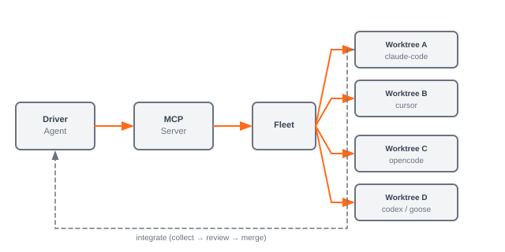

<p align="center">
  
</p>

<h1 align="center">Marshal</h1>

<p align="center">
  Run a fleet of AI coding agents in parallel, in isolated git worktrees, and know exactly what each one cost.
</p>

[](https://github.com/chiruu12/marshal/actions/workflows/ci.yml)
[](LICENSE)
[](pyproject.toml)
[](https://pypi.org/project/MarshalFleet/)

## Proof

One task, four routing strategies, measured cost and latency from the ledger — not a guess.

| Strategy | Backend | Model | Status | Cost | Source | Duration | Tokens (in / out) |
|---|---|---|---|---|---|---|---|
| deepseek | opencode | opencode-go/deepseek-v4-flash | succeeded | **$0.0029** | native | 81.8 s | 11,740 / 1,977 |
| claude | claude-code | claude-sonnet-4-6 | succeeded | $0.3374 | native | 121.4 s | 17 / 6,837 |
| cmdcode | command-code | zai-org/GLM-5.2 | succeeded | `unavailable` | unavailable | 252.6 s | 0 / 0 |
| codex-glm | codex | z-ai/glm-5.1 (via EastRouter) | succeeded | `unavailable` | unavailable | 283.0 s | 231,075 / 7,812 |

**cheapest:** deepseek ($0.0029) · **fastest:** deepseek (81.8 s)

Each produced solution's tests: `deepseek`, `claude`, and `cmdcode` passed 6/6 — **`deepseek` was cheapest, fastest, and correct, for ~1/115th of `claude`'s cost.** Full methodology and tables: [`examples/benchmark-output.md`](examples/benchmark-output.md) and [`docs/nerds.md`](docs/nerds.md).

## Install

```bash
uv tool install MarshalFleet
# or
pipx install MarshalFleet
```

**Claude Code plugin** (Skills + MCP in one step):

```
/plugin marketplace add chiruu12/marshal
/plugin install marshal@marshal
```

Clone from source, backend CLI auth, and MCP wiring: **[`SETUP.md`](SETUP.md)**.

## 60 seconds

**1. Check the fleet is ready.** `doctor` verifies auth, not just that a CLI is on `$PATH` — a backend you cannot actually run fails here rather than 3 seconds into a job.

```console
$ marshal doctor
✓ repo: /path/to/your-repo (branch main)
✓ config: fleet.config.yaml (15 clients)
✓ backend:cursor: available
✓ plan:cursor: Ultra (model Composer 2.5 Fast)
✓ backend:opencode: available
✗ backend:codex: CLI not on PATH / not runnable
    fix: install the Codex CLI, then `codex login` (ChatGPT) or set OPENAI_API_KEY
```

**2. Dispatch a job.** It returns immediately with a run id — the agent works in its own git worktree on its own branch. Your checkout is never touched.

```console
$ marshal spawn --client composer --goal "Add a docstring to hello()"
run_id  hello-docstring.cursor.d56489fe
status  running
branch  marshal/hello-docstring.cursor.d56489fe
worktree .marshal/worktrees/hello-docstring.cursor.d56489fe
```

**3. Watch the fleet.** Any number of agents, any mix of providers, each with its own cost line.

```console
$ marshal status --limit 3
showing 3 of 136 runs (raise --limit to see more)
phase0-logo.claude-code.8413a86c    claude-code  exited_clean  $0.4695
phase0-hygiene.cursor.79639a00      cursor       exited_clean  $0.0000
phase0-readme.cursor.d56489fe       cursor       exited_clean  $0.0000
```

**4. Review, then merge.** From a driver agent over MCP: `collect_run("<run_id>")` returns the diff read-only, and `integrate("<run_id>", message="...")` merges it. `exited_clean` means the process exited cleanly — it does **not** mean the code is correct, so the diff review is not optional.

MCP tool reference: [`docs/mcp-tools.md`](docs/mcp-tools.md). Orientation for drivers: call `marshal_quickstart()` first.

## Why Marshal

- **One base class, many backends** — backend choice is a per-call parameter, never global.
- **Parallel by default** — each agent runs in its own git worktree until you explicitly integrate.
- **Per-provider usage tracking** — every run's cost is tagged by provenance; unknown cost is `unavailable`, never a fake $0.
- **Robust headless execution** — hard timeouts, process-group kill, and no prompting modes that deadlock without stdin.

## How it compares

| | Worktree isolation | Real parallelism | Per-provider cost accounting | Human merge review | Multi-repo |
|---|---|---|---|---|---|
| **Marshal** | yes — one worktree per run | yes — capped `run_many` | yes — native / admin-api / estimated / unavailable | yes — `collect_run` then `integrate` | yes — one MCP server, many workspaces |
| Hand-rolled git worktree scripts | yes — if you build it | possible — you manage threads/processes | no — unless you wire it yourself | possible — you own the merge step | no — one repo per script unless you extend it |
| Subagents inside a single coding harness | partial — often same checkout or sandbox | limited — shared process/context | partial — whatever the host exposes | varies — some hosts auto-apply | no — bound to one session/repo |
| Generic workflow orchestrators (CI, Airflow, Temporal) | no — not their job | yes — at the workflow layer | no — not agent-token aware | yes — human gates are the point | yes — but not coding-agent native |

## What you can drive it with

Seven backend adapters. Model is set per client in `fleet.config.yaml` (or ad-hoc via `--model` / MCP `model=`).

| Backend | Model flag | Cost provenance |
|---|---|---|
| `cursor` | optional (defaults to CLI default) | **unavailable** — individual plans expose no per-run cost |
| `opencode` | `opencode-go/*` (required pattern) | **native** — tokens + cost from the CLI |
| `codex` | provider/model (e.g. `gpt-5.5`) | **admin-api** via EastRouter `usage_api`; else **estimated** (priced model) or **unavailable** |
| `claude-code` | `claude-*` (e.g. `claude-sonnet-4-6`) | **native** — `total_cost_usd` + tokens |
| `command-code` | provider/model (e.g. `zai-org/GLM-5.2`) | **unavailable** — hosted account, no token/cost in stdout |
| `goose` | `provider/model` or bare model (e.g. `cursor-agent/auto`) | **native** when the provider reports positive cost; else **unavailable** (best-effort stream-json) |
| `antigravity` *(experimental)* | `gemini-*`, `claude-*`, etc. | **unavailable** — text-only output |

Routing playbook: [`docs/model-playbook.md`](docs/model-playbook.md). Verification matrix: [`docs/status.md`](docs/status.md).

## Architecture

Marshal is the infrastructure layer between a driver agent and a fleet of headless coding CLIs. The driver plans; Marshal creates worktrees, runs backends with timeouts, records usage to an immutable ledger, and returns diffs for review. A future end-user product (**Chauffeur**) will sit on top — see [`docs/chauffeur-future.md`](docs/chauffeur-future.md).

<p align="center">
  
</p>

Full design: [`docs/design.md`](docs/design.md).

## Documentation

- [`SETUP.md`](SETUP.md) — clone-to-first-run setup.
- [`docs/usage.md`](docs/usage.md) — configure a fleet; drive it via MCP, CLI, or library.
- [`docs/mcp-tools.md`](docs/mcp-tools.md) — MCP tool reference.
- [`docs/config.md`](docs/config.md) — every `fleet.config.yaml` key.
- [`docs/model-playbook.md`](docs/model-playbook.md) — which client to route a task to.
- [`docs/status.md`](docs/status.md) — what's built and verified.
- [`docs/design.md`](docs/design.md) — architecture and backend cheat sheets.
- [`docs/nerds.md`](docs/nerds.md) — numbers, methodology, and the stuff we argue about.
- [`docs/sources.md`](docs/sources.md) — primary sources.

## Contributing

- [`CONTRIBUTING.md`](CONTRIBUTING.md) — dev setup, quality gate, adding a backend.
- [`SECURITY.md`](SECURITY.md) — security model and private disclosure.
- [`CHANGELOG.md`](CHANGELOG.md) · [`CODE_OF_CONDUCT.md`](CODE_OF_CONDUCT.md)

## License

MIT
